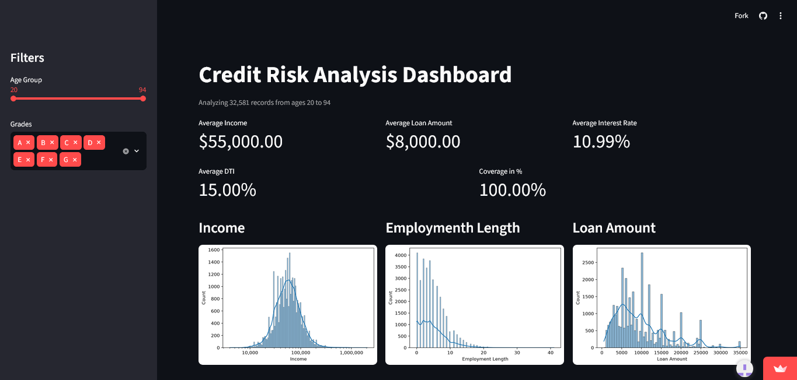

# CREDIT RISK DATASET ANALYSIS
###### From the dataset provided by Lao Tse from [Kaggle](https://www.kaggle.com/datasets/laotse/credit-risk-dataset).

### Skills

* Data Cleaning, Data Engineering, Data Analysis, and Data Visualization
* Python with Jupyter Notebook, Pandas, NumPy, Matplotlib, Seaborn
* Streamlit

### INTRODUCTION

In this Jupyter notebook, the analyst used the Python programming language to analyze the following dataset about the credit risk of borrowers involved, with the intention to examine and analyze trends, findings, and what recommendations can be given based on the results. The main goal of this analysis is to examine the dataset, identify patterns and provide insights regarding the results. In this way, an analyst can then provide recommendations or suggestions that can help improve businesses. In this analysis, the questions the analyst are seeking to answer are:

* What is the overall default rate in our dataset?
* How does the DTI (Debt to Income) ratio correlate with the likelihood of defaulted loans? 
* What would an average borrower profile look like?
* Does the average income change per age group?
* Do borrowers with longer credit history borrow more money?

Other than that, a Streamlit Dashboard was also made to serve as an interactive way for clients to analyze and examine the results of the data analysis.

### METHODOLOGY

The data analyst conducted the dataset examination using Python and Jupyter Notebook in VSCode. The dataset was procured from [Kaggle](https://www.kaggle.com/datasets/laotse/credit-risk-dataset) by the provider Lao Tse. The analysis was done inside a virtual environment with `Python 3.14.6`. The analysis also requires the dependencies inside the `requirements.txt`.  

#### Project Structure

* .root/
  * raw_dataset.csv
  * cleaned_dataset.csv
  * requirements.txt
  * README.md
  * streamlit_app.py
  * cleaned_data/
    * cleaned_column1.csv
    * cleaned_column2.csv

#### Installation
 The project can be cloned using the git:
  ```
  git clone https://github.com/Lastlight10/credit_load_risk_data_analysis.git
  ```

  To install the dependencies, you need to run:
  ```
  python -m pip install -r requirements.txt
  ```

  The following notebooks need to run in the following order:  
  1. 1_data_cleaning_preparation.ipynb  
  2. 2_data_analysis_exploration.ipynb

  To run a local version of the dashboard, you can use:
  ```
  # This needs the streamlit dependency from the requirements.txt
  streamlit run .\streamlit_app.py
  ```

### CONCLUSION

After the cleaning and analysis, the results showed columns with missing data and incorrect inputs that are handled using data cleaning and engineering. The data analysis was done using Pandas, Matplotlib, and Seaborn which shows clear representation and analysis done to the columns. The following questions were also answered and their explanation are fleshed out inside the notebook.

1. What is the overall default rate in our dataset?
  
*Ho*: The default rate is greater than or equal to `20%`.  
*Ha*: The default rate is less than `20%`.  
*Conclusion*: The default rate is `17.63%` which makes the alternative hypothesis favorable and reject the null hypothesis.  

2. How does the DTI (Debt to Income) ratio correlate with the likelihood of defaulted loans?    

*Ho*: There is no relationship between the DTI and the likelihood of defaulting.  
*Ha*: There is a relationship between the DTI and the likelihood of defaulting.  
*Conclusion*: The graph shows the rise of the curve as the DTI increases supports that the alternative hypothesis is favorable while the null hypothesis is rejected.

3. What would an average borrower profile look like?  

*Conclusion*: The average borrowers would be around 26 years old, inside the most frequent age brackets of 18-25 and 26-40. They would have an income of 55,000. They are either renting or paying mortgage for their homes. They are employed for 4 years and their purpose for loaning is quite varied and shows no single dominant intent, therefore the purpose does not have a definite answer. Their loan grade would either be A or B. They would loan $8000 with an interest rate of 10.99%. Their loans are mostly paid off with their DTI ratio being 15%. They have a credit history of 4 years.


4. Does the average income change per age group?  

*Ho*: The average income for each age group does not vary.  
*Ha*: The average income increases the higher the age group.  
*Conclusion*: The null hypothesis can be rejected while the alternative hypothesis can be partially supported as the average income did increase but only up to a certain age group.

5. Do borrowers with longer credit history borrow more money?  

*Ho*: The credit history does not affect the amount of money loaned.  
*Ha*: The credit history does affect the amount of money loaned.  
*Conclusion*: Based on the Pearson's r and line chart, there is not enough evidence to support the alternative hypothesis, therefore the null hypothesis is not rejected.

The dashboard can be accessed using the following link:

[Credit Risk Analysis Dashboard](https://creditloadriskdataanalysis-6mj6zzvrhwhxeecuhrm8gt.streamlit.app/)



To conclude, the Credit Risk Dataset Analysis was successful in answering questions and providing insights regarding the dataset.